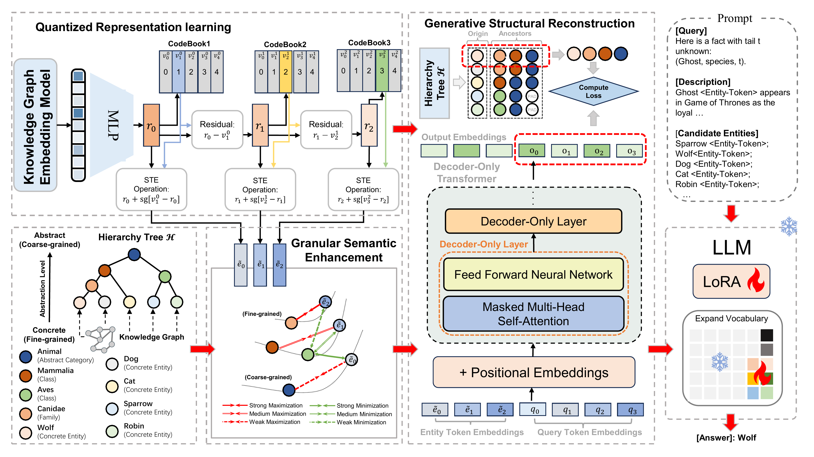

<div align="center">
<h1>GS-Quant Granular Semantic and Generative Structural Quantization for Knowledge Graph Completion</h1>

<a href="https://github.com/mikumifa/GS-Quent"></a>&nbsp;<a></a>&nbsp;<a href="https://opensource.org/licenses/Apache-2.0"></a>

</div>

<p align="center">
  GS-Quant learns semantically structured discrete codes for KG entities and injects them into LLM-based knowledge graph completion.
</p>

<div align="center">
  
</div>

## Highlights

- **Granular Semantic Enhancement (GSE)** aligns quantization levels with coarse-to-fine semantic granularity.
- **Generative Structural Reconstruction (GSR)** turns discrete codes into causally structured semantic descriptors.
- **Quantized entity codes** are injected into LLM prompts for knowledge graph completion.
- The repository provides an **end-to-end pipeline** from hierarchy construction and quantization to LoRA fine-tuning and evaluation.

## Repository Structure

```text
.
├── cluster/                  # hierarchy construction and optional LLM refinement
├── codebook/                 # residual quantization modules
├── dataset/                  # KG dataloaders and argument helpers
├── graph_embedding/          # hierarchy-aware KG embedding model
├── scripts/                  # training / analysis shell scripts
├── train_graph_embedding.py  # stage 1: graph embedding training
├── train_codebook.py         # stage 2: codebook training
├── use_codebook.py           # export quantized entity ids and token vocabulary
├── adapter_lora_data.py      # convert external KG-LLM data into token-augmented JSONL
├── train_lora.py             # stage 3: LoRA fine-tuning
├── eval_llm.py               # generation and evaluation pipeline
└── eval_on_dataset.py        # standalone metric computation from predictions
```

## Installation

This project is managed with [`uv`](https://github.com/astral-sh/uv).

```bash
uv sync
```

The current `pyproject.toml` requires **Python 3.13+**. Main dependencies include PyTorch, Transformers, PEFT, DeepSpeed, Accelerate, and vLLM.

If you train large models, make sure the local environment also provides:

- CUDA-compatible PyTorch
- enough GPU memory for your chosen backbone
- a working DeepSpeed / NCCL setup for multi-GPU runs

## Data Layout

### 1. Knowledge graph data

Raw benchmark data is expected under:

```text
data/<dataset>/
├── entities.dict
├── relations.dict
├── train.txt
├── valid.txt
├── test.txt
└── entity2text.txt / entity.json   # optional but recommended
```

`train_graph_embedding.py` and related utilities assume the standard entity / relation dictionary format and triple files separated by tabs.

### 2. Processed hierarchy data

Precomputed hierarchy artifacts are stored under:

```text
processed_data/<dataset>/
├── entity_init_embeddings.npy
├── clusters_embeddings_seed.npy
├── clusters_embeddings_llm.npy
├── seed_hierarchy.json
├── llm_hierarchy.json
├── entity_info_seed_hier.json
└── entity_info_llm_hier.json
```

These files are produced by the hierarchy construction pipeline in [`cluster/`](./cluster).

### 3. External KG-LLM supervision data

`adapter_lora_data.py` can adapt third-party instruction-tuning datasets from
[DIFT](https://github.com/nju-websoft/DIFT), stored in the following layout:

```text
data/DIFT-dataset/<dataset_alias>/<source>/data_KGELlama/
├── train.json
├── valid.json
└── test.json
```

The script converts them into this repository's JSONL format and optionally inserts quantized entity tokens into prompts and candidates.

## End-to-End Pipeline

For convenience, the repository also provides one-command batch scripts for common runs, such as
[scripts/batch_lora_codebook_gpu_multi.sh](./scripts/batch_lora_codebook_gpu_multi.sh) and
[scripts/batch_lora_codebook_gpu.sh](./scripts/batch_lora_codebook_gpu.sh).

### 1. Build hierarchies

For hierarchy construction and the corresponding processed files, please refer to
[KG-FIT](https://github.com/pat-jj/KG-FIT). This repository assumes the hierarchy
artifacts have already been prepared under `processed_data/<dataset>/`.

### 2. Train graph embeddings

For graph embedding training, please refer to the provided shell script
[scripts/run_train_graph_embedding.sh](./scripts/run_train_graph_embedding.sh).
The resulting checkpoints are written to:

```text
processed_data/<dataset>/checkpoints/<model>_<hierarchy_type>_batch_<...>/
```

Depending on flags, this stage can also export top-k hit records for later adapter-data creation.

### 3. Train the codebook

Train the residual quantizer with [train_codebook.py](./train_codebook.py), using:

- graph embedding checkpoints from Step 2
- hierarchy-aware cluster embeddings under `processed_data/<dataset>/`
- hierarchy metadata such as `entity_info_llm_hier.json`

This stage produces a codebook checkpoint and the corresponding quantized entity representations:

- `entity_quantized.json`: quantized code indices for each entity
- `tokens.json`: textual token vocabulary derived from the codebook

If needed, they can be exported afterward with [use_codebook.py](./use_codebook.py).

### 4. Build token-augmented instruction data

Use [adapter_lora_data.py](./adapter_lora_data.py) to convert DIFT-style supervision data into this repository's JSONL format by combining:

- the external KGC supervision data from DIFT
- the quantized entity codes from Step 3
- entity metadata from the processed hierarchy files

If `--wrap_token` is enabled, the script also updates `tokens.json` with:

- `<#begin_of_entity>`
- `<#end_of_entity>`

The generated records follow the standard instruction-tuning format:

```json
{ "instruction": "...", "input": "", "output": "..." }
```

### 5. Fine-tune an LLM with LoRA

Use [train_lora.py](./train_lora.py) to fine-tune the LLM on the token-augmented JSONL data from Step 4. During training:

- New quantized tokens are appended to the tokenizer vocabulary when `--tokens_file` is provided.
- LoRA target modules default to `q_proj,v_proj`.
- The training file can be `json`, `jsonl`, or `csv`.

### 6. Run evaluation

Use [eval_llm.py](./eval_llm.py) to generate predictions and compute ranking metrics on the test split. It saves:

- `predictions.jsonl`
- `metrics.json`
- `rank_predictions.csv`
- `eval_args.json`

For post-hoc metric computation from an existing prediction file, use [eval_on_dataset.py](./eval_on_dataset.py).

## Citation

If you use this repository, please cite our paper:

```bibtex
@inproceedings{todo_acl_2026,
  title     = {TODO},
  author    = {TODO},
  booktitle = {Proceedings of the Association for Computational Linguistics (ACL)},
  year      = {2026}
}
```

## Acknowledgements

This project builds on open-source tooling from PyTorch, Hugging Face Transformers, PEFT, Accelerate, DeepSpeed, and related KG benchmark ecosystems.

## License

This project is released under the Apache-2.0 License. See [`LICENSE`](./LICENSE) for details.
